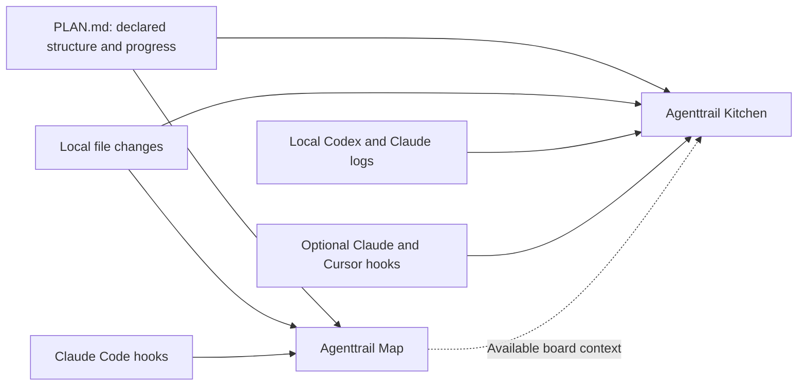

# How Agenttrail observes your agents

Agenttrail is a local observability tool for AI coding agents. It reads available evidence of their work and presents it in two views: **Agenttrail Map** and **Agenttrail Kitchen**. You continue to prompt, run and approve your agents in their existing tools.

The project focuses on what is changing, which tasks are reported, who contributed and where attention is needed. It does not currently provide token billing, model-quality evaluations or a complete trace of every model request.

## One project, two views

| | Map | Kitchen |
| --- | --- | --- |
| Question it helps answer | Which parts of this project are changing, and how do they relate? | What work is happening now, and which responsibilities contribute? |
| Unit of structure | A durable component in `PLAN.md` | A project responsibility, shown as a chef |
| Unit of work | Plan tasks, file activity and supported run events | An available native todo, shown as a dish |
| Presentation | Components, dependencies, activity and session trails | Chefs, order tickets, cooking and deliveries |
| Command | `npx agenttrail` | `npx agenttrail-kitchen .` |
| Default local port | 5330 | 4780 |

Both are browser companions in this repository. Each has its own package, local service, adapters and history. Either can run independently. Kitchen can read context from a running Map, but there is not yet one shared event backend or a synchronized view switcher.

## Where the information comes from

`PLAN.md` describes durable project components and declared task status. File watching supplies evidence of edits, including changes to a component whose plan already says it is done. File changes alone do not identify an agent or prove that a task succeeded.

Provider logs and hooks add session identity, tool activity, lifecycle events and native tasks where supported. Native tasks are the agent's temporary work list; they can change as a session progresses. Kitchen uses these for order tickets rather than inventing a task breakdown from the project plan.

| Available evidence | Map | Kitchen |
| --- | --- | --- |
| Local file changes | Yes | Yes |
| Durable `PLAN.md` | Component map and declared progress | Project context and role associations |
| Codex native activity and plans | No direct adapter; file/plan observation remains available | Experimental local log adapter |
| Claude Code session/tool activity | Optional hooks | Local logs and optional hooks |
| Claude native task lists | Legacy `TodoWrite`; newer `TaskCreate`/`TaskUpdate` are not parsed | Legacy lists and supported modern task results |
| Cursor native activity | No direct adapter; file/plan observation remains available | Optional hooks; native live validation pending |
| Confirmed artifact transfer | No receipt model; trails may suggest a handoff from timing | Explicit artifact revision and receipt metadata |

Local Codex and Claude collaboration has been exercised. The automated Kitchen checks run on Linux and macOS; Windows and native Cursor validation remain pending. Cloud sessions need accessible local logs or an explicit integration. [Kitchen discovery and connection limits](kitchen/CONNECTING.md)

## What the kitchen means

Suppose an agent reports “Implement the endpoint” and “Test validation” while building an API. These can appear as two order tickets. As the session researches, edits and runs checks, its contributions can be associated with different role chefs. When the native task reports completion, its dish travels to the deliverable table.

A chef is a responsibility, not necessarily a separate agent process. A single session can contribute through several chefs in sequence. The interface keeps the real provider/session identity available separately. Multiple sessions sharing a dish and passing confirmed artifacts require explicit bindings and receipt metadata; matching filenames or similar task names do not prove collaboration.

Treat the visuals as different kinds of evidence:

- **Reported:** plan status, native todos and supported lifecycle events supplied by the source.
- **Observed:** local file changes and recognized operations.
- **Inferred:** a responsibility or component associated with a file, task or operation. The interface labels these matches.
- **Unknown:** unavailable native tasks, missing history or an unsupported event format. Missing progress is not a fabricated percentage.

A completed dish means a native todo was reported complete. A deployment or published outcome needs its own evidence. Example mode is explicitly labeled and scripted.

## Current integration limits

Map and Kitchen have not yet consolidated their provider handling, so each keeps its own history. They can run side by side: both hook setups can be installed in either order without removing each other, and Map activity never replaces a native todo list that Kitchen has observed. Kitchen changes a native todo list only when the tool result confirms the update; a rejected or interrupted `update_plan` or `TodoWrite` leaves the last confirmed list in place.

## What stays on your machine

Both services bind to `127.0.0.1`. They require no Agenttrail account, telemetry service, transcript upload or extra model call. The local browser uses bundled graphics/fonts or system fonts.

Both services share one allowlist, `packages/kitchen/src/runtime/payload-allowlist.mjs`. It names the only fields the browser may receive for each event kind or hook. Anything not named is dropped before the event is stored, so a new field stays private until someone adds it on purpose. Raw prompts, reasoning, command bodies, tool arguments and tool output never reach either browser.

Three rules apply on top of the field lists:

- **Paths are project-relative.** An absolute path under a watched project becomes a path relative to it; a path outside every project is reduced to its file name. Kitchen identifies each project by an opaque handle (a short hash of its root), so the browser can select and name a project without learning where it lives.
- **Token-like strings are redacted.** Common key prefixes, bearer tokens, JSON web tokens, private-key blocks and long random-looking strings are replaced with `[redacted]`, wherever they appear. The check is a character-class heuristic, so it can redact a long identifier that is not a secret.
- **Free text is capped.** Task titles, todo text and file paths are flattened to one line, redacted and cut to a fixed length.

### Kitchen: fields per event kind

Every Kitchen event carries the identity fields `id`, `provider`, `sessionId`, `parentId`, `cwd`, `at`, `source`, `kind` and `turnId`. In the browser feed `cwd` is project-relative. The task fields are `tasks` (each with `id`, `title` and `status`), `tasksPartial`, `planId`, `outcomeId`, `outcomeTitle` and `taskChange` (`id`, `title`, `status`). `work` carries `category`, `label`, `file` and `completed`.

| Event kind | Fields beyond identity |
| --- | --- |
| `session-end`, `permission`, `input`, `interrupted`, `unknown` | none |
| `session-start`, `turn-start` | task fields |
| `turn-end` | `error` |
| `tool-start` | `tool`, `toolId`, `file`, `work`, task fields |
| `tool-end` | `tool`, `toolId`, `file`, `error`, `work`, task fields |
| `activity` | `tool`, `file`, task fields |
| `role` | `roleId`, `workflowId`, `runId`, `itemId`, `orderId` |
| `observation` | `work` |

Artifact events (`produced`, `offered`, `received`, `failed`) carry `id`, `artifactId`, `revisionId`, `provider`, `sessionId`, `cwd`, `kind`, `file`, `type`, `label` and `orderId`. All but `produced` add `handoffId`, `recipientProvider` and `recipientSessionId`. An unknown event kind is refused outright.

### Map: fields per hook

Map accepts six Claude Code hooks. Each carries `hook_event_name`, `session_id`, `cwd` and `agent`. The two tool hooks add `tool_name` and a reduced `tool_input`; nothing else from a hook is read.

| Hook | Fields beyond identity |
| --- | --- |
| `SessionStart`, `SessionEnd`, `Stop`, `SubagentStop` | none |
| `PreToolUse`, `PostToolUse` | `tool_name`; `tool_input` reduced to `file_path`, `notebook_path` and `todos` (`content`, `status`) |

The Map shows a project-relative file path for a tool call that names one and no detail otherwise, so a shell command, search term, URL or prompt is never displayed. A sub-agent appears as a generic `sub-agent` row, because its description is a prompt. Run state saved under `~/.agenttrail` is built from the same fields, and a state file written by an older version is cleaned the same way when it is loaded.

### What can still be visible

- **Titles are free text.** Kitchen task titles, native todo text and Map todo text are capped and redacted but are otherwise whatever the agent wrote, so a sensitive sentence in a title still appears. The Map shows `PLAN.md` text as written, since it is your own file.
- **The Map's local-action endpoints are outside the allowlist.** `/whoami`, `/suggest` and `/spawn` still read and return absolute repository paths so that boards can find each other and start a sibling board. They are tracked as an open task in [PLAN.md](../PLAN.md).
- **Kitchen still reads widely.** The log adapter reads Codex and Claude logs for every project on the host, not only the watched ones. The allowlist limits what reaches the browser, not what the process reads.
- **The Map's registry keeps the repository path.** `repoPath` in the saved state is how `agenttrail up` restarts boards. It stays on local disk and is not served to the browser.

Saved repo selection and connector registration for Kitchen live under `~/.agent-office` by default. Its order history is held in memory and reconstructed from available observations after restart. The Map saves recent activity and cycle summaries under `~/.agenttrail`. Check what is on screen before sharing screenshots or recordings.

Normal watching does not edit your repo. Explicit Map setup creates plan/instruction files and a `.gitignore` entry, and offers Claude hooks; noninteractive `init` assumes yes. Kitchen's optional **Connect agents** flow writes the reviewed provider hook configuration. Neither view sends agent prompts, approves provider actions or changes native task status.

[Start Kitchen](kitchen/README.md) · [Start Map](../README.md#run-the-project-map) · [Contribute](../CONTRIBUTING.md)
