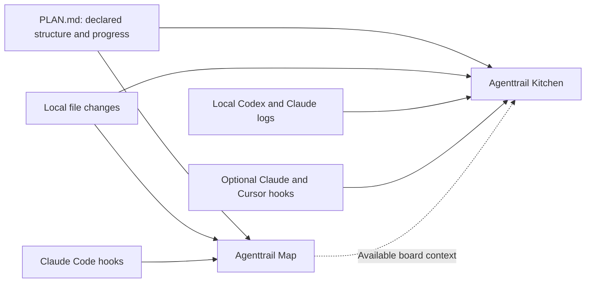

# How Agenttrail observes your agents

Agenttrail is a local observability tool for AI coding agents. It reads available evidence of their work and presents it in two views: **Agenttrail Map** and **Agenttrail Kitchen**. You continue to prompt, run and approve your agents in their existing tools.

The project focuses on what is changing, which tasks are reported, who contributed and where attention is needed. It does not currently provide token billing, model-quality evaluations or a complete trace of every model request.

## One project, two views

| | Map | Kitchen |
| --- | --- | --- |
| Question it helps answer | Which parts of this project are changing, and how do they relate? | What work is happening now, and which responsibilities contribute? |
| Unit of structure | A durable component in `PLAN.md` | A project responsibility, shown as a chef |
| Unit of work | Plan tasks, file activity and supported run events | An available native todo, shown as a dish |
| Presentation | Components, dependencies, activity and session trails | Chefs, order tickets, cooking and deliveries |
| Command | `npx agenttrail` | `npx agenttrail-kitchen .` |
| Default local port | 5330 | 4780 |

Both are browser companions in this repository. Each has its own package, local service, adapters and history. Either can run independently. Kitchen can read context from a running Map, but there is not yet one shared event backend or a synchronized view switcher.

## Where the information comes from

`PLAN.md` describes durable project components and declared task status. File watching supplies evidence of edits, including changes to a component whose plan already says it is done. File changes alone do not identify an agent or prove that a task succeeded.

Provider logs and hooks add session identity, tool activity, lifecycle events and native tasks where supported. Native tasks are the agent's temporary work list; they can change as a session progresses. Kitchen uses these for order tickets rather than inventing a task breakdown from the project plan.

| Available evidence | Map | Kitchen |
| --- | --- | --- |
| Local file changes | Yes | Yes |
| Durable `PLAN.md` | Component map and declared progress | Project context and role associations |
| Codex native activity and plans | No direct adapter; file/plan observation remains available | Experimental local log adapter |
| Claude Code session/tool activity | Optional hooks | Local logs and optional hooks |
| Claude native task lists | Legacy `TodoWrite`; newer `TaskCreate`/`TaskUpdate` are not parsed | Legacy lists and supported modern task results |
| Cursor native activity | No direct adapter; file/plan observation remains available | Optional hooks; native live validation pending |
| Confirmed artifact transfer | No receipt model; trails may suggest a handoff from timing | Explicit artifact revision and receipt metadata |

Local Codex and Claude collaboration has been exercised. The automated Kitchen checks run on Linux and macOS; Windows and native Cursor validation remain pending. Cloud sessions need accessible local logs or an explicit integration. [Kitchen discovery and connection limits](kitchen/CONNECTING.md)

## What the kitchen means

Suppose an agent reports “Implement the endpoint” and “Test validation” while building an API. These can appear as two order tickets. As the session researches, edits and runs checks, its contributions can be associated with different role chefs. When the native task reports completion, its dish travels to the deliverable table.

A chef is a responsibility, not necessarily a separate agent process. A single session can contribute through several chefs in sequence. The interface keeps the real provider/session identity available separately. Multiple sessions sharing a dish and passing confirmed artifacts require explicit bindings and receipt metadata; matching filenames or similar task names do not prove collaboration.

Treat the visuals as different kinds of evidence:

- **Reported:** plan status, native todos and supported lifecycle events supplied by the source.
- **Observed:** local file changes and recognized operations.
- **Inferred:** a responsibility or component associated with a file, task or operation. The interface labels these matches.
- **Unknown:** unavailable native tasks, missing history or an unsupported event format. Missing progress is not a fabricated percentage.

A completed dish means a native todo was reported complete. A deployment or published outcome needs its own evidence. Example mode is explicitly labeled and scripted.

## Current integration limits

Map and Kitchen have not yet consolidated their provider handling, so each keeps its own history. They can run side by side: both hook setups can be installed in either order without removing each other, and Map activity never replaces a native todo list that Kitchen has observed. Kitchen changes a native todo list only when the tool result confirms the update; a rejected or interrupted `update_plan` or `TodoWrite` leaves the last confirmed list in place.

## Feed-only mode

`agenttrail-kitchen --feed-only` is for an external system that pushes events in, such as OJ Labs Director. It changes what Kitchen reads and what it accepts:

- **Read:** nothing outside the package. It does not discover or read Codex or Claude logs, watch any folder, read `PLAN.md`, inspect provider hook configuration, or create a state directory. The project paths you pass are names for the incoming events and are never opened. The only files read are Kitchen's own bundled page, graphics and schema.
- **Accepted:** `POST /api/hook` and `POST /api/artifact`, only with a bearer token that you supply in `AGENTTRAIL_FEED_TOKEN`. The service will not start without one. Every event is checked against a published JSON Schema, and unknown fields are rejected. The setup, attach and add-project routes do not exist in this mode.
- **Sent to the browser and to any client of the three GET routes:** the same snapshot as normal mode, built only from the events you posted. That includes task titles, session identifiers, tool names and file names made relative to the project root. The GET routes need no token, so a feeder that exposes the Kitchen to other people must add its own authentication.

The field-by-field contract is in [Feed-only mode](kitchen/FEED.md).

## What stays on your machine

Both services bind to `127.0.0.1`. They require no Agenttrail account, telemetry service, transcript upload or extra model call. The local browser uses bundled graphics/fonts or system fonts.

Kitchen reads provider logs only for the folders you watch. A Claude or Codex session is used only if its recorded working directory is inside a watched root; other projects' sessions are not parsed, tracked, counted, listed or sent to the browser. Claude's log directories are filtered by name before anything is opened (a sibling folder whose name merely starts with a watched one can still have its first lines opened and discarded). Codex rollouts are not filed by project, so the first 64 KiB of each recent rollout is opened to read its working directory and discarded if it is outside the watched roots. `--sources hooks,logs,files` selects which evidence is used, and `--no-discovery` stops Kitchen listing or opening anything under `~/.codex`, `~/.claude` or `~/.agenttrail`. Map has no log reader. It suggests no other repository, with or without `--no-discovery`: it neither reads other projects' records in `~/.agenttrail` nor lists sibling folders, so its `/suggest` answer is always empty. `--sources` can switch off its hook endpoint and its file-activity watching (it still reloads `PLAN.md`). [Exactly what is touched](kitchen/CONNECTING.md#local-scope-and-discovery-limits)

Kitchen processes bounded local log data and sends allowlisted activity metadata to its browser. Task titles and project paths can be visible; raw prompts, reasoning, command bodies and arbitrary tool outputs are excluded from that browser feed. Saved repo selection and connector registration live under `~/.agent-office` by default. Its order history is held in memory and reconstructed from available observations after restart.

Map's Claude hook relay sends hook payloads to local Map services. The Map view can show shortened command text, search terms and other tool details, and saves recent activity and cycle summaries under `~/.agenttrail`. It does not have Kitchen's narrower browser-field policy. Check visible details before sharing screenshots or recordings.

Normal watching does not edit your repo. Explicit Map setup creates plan/instruction files and a `.gitignore` entry, and offers Claude hooks; noninteractive `init` assumes yes. Kitchen's optional **Connect agents** flow writes the reviewed provider hook configuration. Neither view sends agent prompts, approves provider actions or changes native task status.

[Start Kitchen](kitchen/README.md) · [Start Map](../README.md#run-the-project-map) · [Contribute](../CONTRIBUTING.md)
